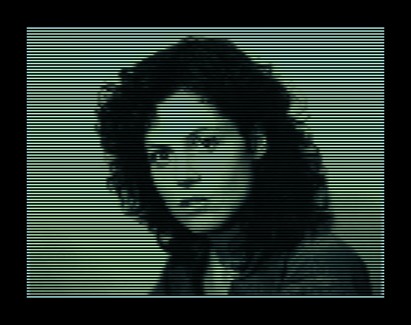
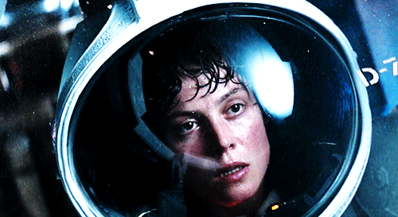
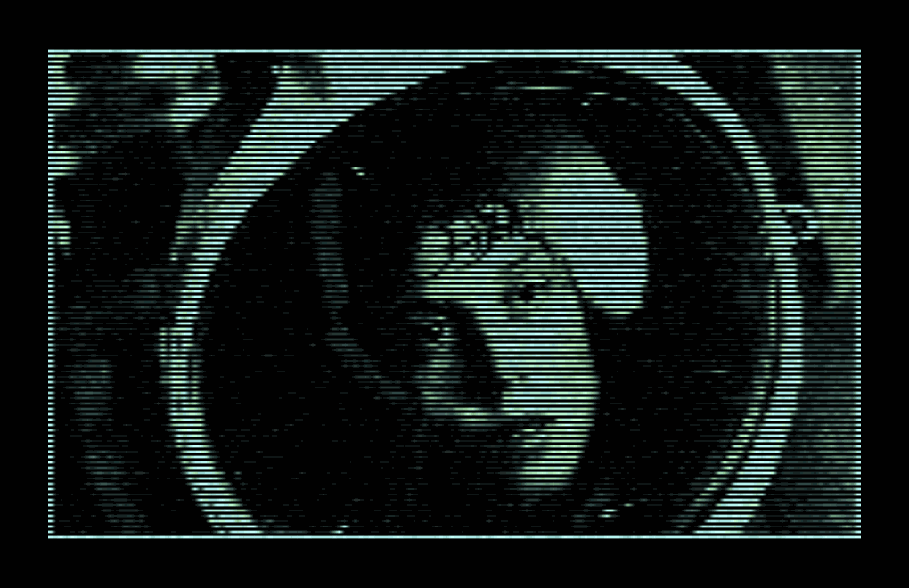

# Scanline Effects in Python

A Python-based library that recreates a retro-futuristic "scanline" style. It allows you to apply scanlines to:

- **Static images** (PNG, JPEG, etc.)
- **Animated GIFs** (frame-by-frame processing)

> **Note:** This project is inspired by the R [scanline](https://github.com/cj-holmes/scanline) package's approach to scanline effects. However, the results may differ slightly due to underlying implementations in Pillow, NumPy, and ImageIO.

## Features

- **Static image processing** via `scanline()`:
  - Resizes the image to a specified vertical resolution.
  - Applies customizable alpha-based scanline patterns, color mapping, borders, and optional noise.
- **GIF animation processing** via `scanline_gif()`:
  - Reads each GIF frame, flattens cumulatively (like R’s `image_flatten`), then applies the scanline effect.
  - Returns all frames plus per-frame durations, which can be saved as a new GIF.
- **Matplotlib figure support**:
  - Export plots to in-memory PNG and pass them into `scanline()` to produce stylized visualizations.

## Showcase

| Original | Scanlined |
|:--------------:|:---------------:|
|  |  |
|   |  |

## Installation

```bash
pip install pyscanline
```

## Quick Start

### 1. Apply scanline to a static image

```python
from pyscanline import scanline


# Apply the scanline effect
result_img = scanline(
    "dog.png",
    n_scanlines=60,
    scanline_col=("black", "darkslategrey", "#b4eeb4", "paleturquoise"),
    opacities=(1, 0.6, 0, 0, 0.6, 1),
    frame_size=10,
    add_noise=False
)

# Save the result
result_img.save("scanlined_dog.png")
```

### 2. Process a GIF with scanline

```python
from pyscanline import scanline_gif, convert_frames_to_gif

frames, durations = scanline_gif(
    gif="alien-1979.gif",
    width=600,
    height=600,
    scale=1.0,
    fps=10,
    delay=None,
    n_scanlines=80,
    frame_size=5,
    add_noise=True,
)

# Save processed frames as a new GIF
convert_frames_to_gif(frames, "alien_scanlined.gif")
```

### 3. Apply scanline to a Matplotlib figure

```python
import io
import matplotlib.pyplot as plt
import numpy as np
from PIL import Image
from pyscanline import scanline


def apply_scanline_to_figure(fig, **kwargs):
    buf = io.BytesIO()
    fig.savefig(buf, format='png', bbox_inches='tight')
    buf.seek(0)
    img = Image.open(buf).convert("RGB")
    return scanline(img, **kwargs)

# Example: Probability Density Plot
np.random.seed(42)
data = np.random.normal(0, 1, 5000)

fig, ax = plt.subplots()
ax.hist(data, bins=50, density=True, alpha=0.3, label="Histogram")
ax.set_title("Probability Density")
ax.legend()

scanlined_plot = apply_scanline_to_figure(
    fig,
    n_scanlines=60,
    opacities=(1, 0.5, 0, 0, 0.5, 1),
    frame_size=5
)
scanlined_plot.save("scanlined_plot.png")
```

## Configuration Options

- **`n_scanlines`**: Target vertical resolution before applying the effect.
- **`scanline_col`**: Tuple of color names/hex codes for the color gradient.
- **`opacities`**: Sequence of alpha values to create the repeating scanline pattern.
- **`frame_size`**: Percentage-based outer border added after processing.
- **`border_size` & `border_intensity`**: Inner border width and brightness in grayscale.
- **`add_noise` / `noise_type`**: Optionally apply Gaussian or other noise.
- **`delay` & `fps`** (GIF only): Frame delay or frames-per-second to control animation speed.

See the function docstrings for more details on each parameter.

## Testing

This project includes **pytest**-based unit tests. From the root directory:

```bash
pytest
```

It tests:

- **`scanline()`** on static images of different modes (RGB, RGBA, L).
- **`scanline_gif()`** on multi-frame GIFs.
- **`flatten_frames()`** alpha-compositing.
- **`convert_frames_to_gif()`** for GIF generation.

## Contributing

Contributions, bug reports, and suggestions are welcome! Please open an issue or pull request. Make sure to:

1. Run `pytest` to confirm all tests pass.
2. Adhere to style guidelines (PEP 8).
3. Include docstrings or comments where appropriate.

## License

GPLv3 License. See [LICENSE](./LICENSE) for details.

---

**Enjoy creating retro-futuristic scanlines for your images and animations!**
